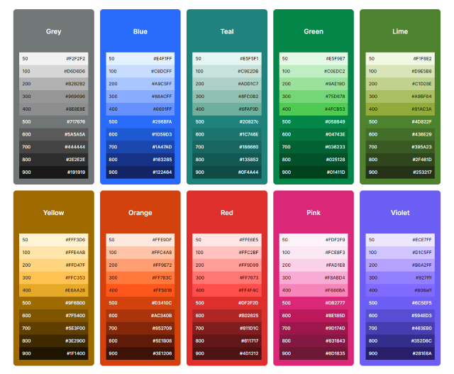
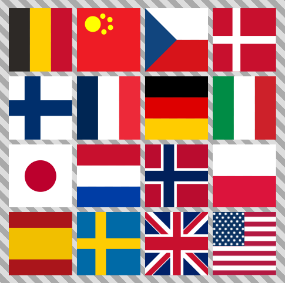

# Web App Template

Welcome to an incredible full-stack web application template powered by
[Next.js](https://nextjs.org/)! It is a full-fledged, ready-to-deploy foundation for your next big
project.

<!-- toc -->

-   [Getting Started with Template Configuration](#getting-started-with-template-configuration)
-   [Features](#features)
    -   [Database Setup](#database-setup)
    -   [Social Login and User Management](#social-login-and-user-management)
    -   [UI Library](#ui-library)
        -   [Homogenous Color Palette](#homogenous-color-palette)
    -   [Comprehensive Testing](#comprehensive-testing)
    -   [State Management and Data Fetching](#state-management-and-data-fetching)
    -   [Form Handling](#form-handling)
    -   [Multi-Language Support with SEO Optimization](#multi-language-support-with-seo-optimization)
    -   [Open Graph](#open-graph)
    -   [Out-of-the-Box PWA Setup](#out-of-the-box-pwa-setup)
        -   [favicons Script](#favicons-script)
        -   [next-pwa Integration](#next-pwa-integration)
    -   [Prudent Routing Choice Ensures Stability](#prudent-routing-choice-ensures-stability)
-   [NPM Scripts Explained](#npm-scripts-explained)

<!-- tocstop -->

## Getting Started with Template Configuration

Welcome to the initial setup! Here’s a simplified guide to adjusting the essential elements in the
template to match your project requirements:

1. **Environment Configuration:**

    - Duplicate the `.env.local` file.
    - Fill in the necessary values within the newly copied file.

2. **Docker Development Setup:**

    - Open the `docker:dev` section.
    - Modify the database name and port. Ensure the port number matches the one specified in your
      `.env.local` file.

3. **PWA Configuration:**

    - Navigate to `pwa.config.mjs`.
    - Update the theme color, app name, app icons, and splash screens as per your preferences.

4. **Node Version:**

    - Ensure you are utilizing the Node version specified in the `.nvmrc` file.

5. **CSS Variable Prefix:**

    - Go to `src/ions/theme/constants.ts`.
    - Alter the `CSS_VARIABLE_PREFIX` to your desired value.

6. **Theme Adjustment (Optional):**
    - Head over to `src/ions/theme/index.ts` for basic theme adjustments.
    - For more granular control, you may venture into `src/ions/theme/palette.ts`, although it's
      strongly discouraged. The existing palette has been meticulously optimized for various aspects
      including UI accessibility (a11y) support, and altering it may affect these optimizations.

By following these steps, you'll have personalized the template to a good extent, making it more
aligned with your project's needs. Happy coding!

## Features

### Database Setup

-   **Prisma**: We utilize the robust [Prisma](https://www.prisma.io/) database with pre-configured
    scripts via `@prisma/client`. Prisma offers a strong Object-Relational Mapping (ORM) layer for
    easy data access and manipulation.

-   **PostgreSQL**: Paired with Prisma, we use [Postgres](https://www.postgresql.org/) as our
    database engine of choice, known for its reliability and feature set.

-   **Docker**: For ease of local setup, we've configured a [Docker](https://www.docker.com/)
    container that runs Postgres. This ensures that you don't need to install Postgres locally,
    making it easier to manage your development environment.

> You can start the database container using the `docker:dev` script in your package.json.

### Social Login and User Management

-   **Social Login**: Integrated with [Auth.js](https://authjs.dev/) (formerly known as
    [NextAuth](https://next-auth.js.org/)) for seamless social login options.
-   **User Preferences**: Includes a GDPR-ready Cookie Banner for user privacy.

### UI Library

-   **Core UI**: Leverage the power of [Joy UI](https://mui.com/joy-ui/getting-started/), the
    next-gen UI library.
-   **Additional UI Elements**: Material icons (`@mui/icons-material`).

#### Homogenous Color Palette

Crafting top-notch user experiences? That's our jam. So, we rolled out a homogenous color palette.
It's not just about the looks - it's a strategic move to boost user understanding and make our
interfaces robust.

-   **Consistent Accessibility**: All 500-shade colors are AA compliant against both black and
    white.
-   **Optimal Text Visibility**: The 500 shades are optimized to pair best with white text.
-   **Component Compatibility**: Uniformity ensures a seamless fit across all components.
-   **Intuitive Gradients**: Clear understanding of shades and hues aids in design decisions.
-   **Broad Hue Range**: With 9 distinct hues and a neutral grey, we ensure diversity in design
    choices.
-   **Inter-hue Harmony**: Consistent shading across hues guarantees a harmonious UI.
-   **Wide Compatibility**: This palette is designed to blend seamlessly with varied UI elements and
    layouts.

By leveraging this palette, we're fusing design intuition with top-tier development to deliver a
cohesive and user-centric product.

   

### Comprehensive Testing

-   **Unit Testing**: [Jest](https://jestjs.io/) for unit tests.
-   **Behavioral Testing**: [Cucumber.js](https://cucumber.io/) for
    [BDD](https://cucumber.io/docs/bdd/).
-   **End-to-End Testing**: [Playwright](https://playwright.dev/) for running Cucumber tests.

**Links**

-   [Gherkin Reference](https://cucumber.io/docs/gherkin/reference/)

### State Management and Data Fetching

-   **SWR**: For React hooks-based data fetching: [SWR](https://swr.vercel.app/).
-   **Fetching**: Use [Axios](https://axios-http.com/docs/intro) for simplified fetching.
-   **Jotai**: Minimalist atomic state management: [Jotai](https://jotai.org/).

### Form Handling

-   **React Hook Form**: Efficient and flexible form management:
    [React Hook Form](https://react-hook-form.com/).

### Multi-Language Support with SEO Optimization

Our platform ingeniously combines the power of
[next-i18next](https://github.com/i18next/next-i18next) for user interface translations with a
handcrafted solution for mapping localized MDX files. The latter is achieved by incorporating
rewrites and redirects within the `next.config.mjs`, ensuring a seamless mapping of pages like
**"my/page/index.mdx" to EN ("/my/page")** and **"my/page/de.mdx" to DE ("/de/my/page")**, with the
flexibility to alter this default mapping as per project needs.

> If your default language is German, you can change your "de.mdx" to "en.mdx".
>
> -   **"my/page/index.mdx" to DE ("/my/page")**
> -   **"my/page/en.mdx" to EN ("/en/my/page")**

This distinctive setup not only automates language mapping but also addresses SEO concerns
proficiently. By generating canonical and alternate tags for both "x-default" and localized
versions, we ensure optimal SEO performance, making the platform easily discoverable across
different language-based search engines.

The fusion of [next-i18next](https://github.com/i18next/next-i18next) for UI translations and our
unique MDX file mapping logic contributes to a robust, SEO-optimized, and user-friendly
multi-language environment, making the platform highly accessible and engaging for a global
audience.

Moreover, we have enriched our multi-language support with 16 meticulously hand-coded svg country
flags, provided as react components, adding a visual cue to the language selection process.

    <table>
        <tr>
            <td>
                <ul>
                    <li>Belgium</li>
                    <li>China</li>
                    <li>Czech</li>
                    <li>Denmark</li>
                    <li>Finland</li>
                    <li>France</li>
                    <li>Germany</li>
                    <li>Italy</li>
                    <li>Japan</li>
                    <li>Netherlands</li>
                    <li>Norway</li>
                    <li>Poland</li>
                    <li>Spain</li>
                    <li>Sweden</li>
                    <li>U.K.</li>
                    <li>U.S.A.</li>
                </ul>
            </td>
            <td>
                
            </td>
        </tr>
    </table>

### Open Graph

We use [Satori](https://github.com/vercel/satori), an enlightened library that converts HTML and CSS
to SVG or PNG, to automate the generation of Open Graph images and social cards.

-   **Seamless Integration**: Comes preconfigured for Next.js.

-   **Wide Usage**: Ideal for generating PNG images for Open Graph and social cards, making your web
    app more shareable and visually engaging on social platforms.

### Out-of-the-Box PWA Setup

#### favicons Script

-   **Functionality**: Generates favicons, splash screens, and a manifest file that are crucial for
    a polished web app. Additionally, it creates a React component that takes care of rendering all
    necessary meta tags and links in the header.

-   **Customization**: The script works excellently out-of-the-box but can be customized via a
    `pwa.config.mjs` file.

#### next-pwa Integration

Further enhancing our PWA setup, we also integrate
[Next PWA](https://github.com/shadowwalker/next-pwa), a zero-config PWA plugin powered by workbox
and optimized for Next.js.

-   **Zero-Config**: No need to manually register or generate a service worker, as `next-pwa` takes
    care of this for you.

-   **Performance**: Maximizes Lighthouse score and optimizes both precache and runtime cache.

-   **Flexibility**: Offers workbox configuration options for those who need more control, without
    the need for a custom server.

By integrating `next-pwa`, we provide an all-in-one solution that handles all PWA requirements,
giving you complete offline support, optimized caching, and more.

Together with the `favicons` script, you get a comprehensive, yet customizable, PWA setup that
allows you to focus on your core app functionality.

### Prudent Routing Choice Ensures Stability

In the evolving landscape of Next.js, the emergence of app router has certainly piqued interest.
However, amid the ongoing adaptation phase of many libraries towards React's server-side components,
we've opted for the original pages router from Next.js over the app router. Our decision stems from
a desire to avoid being prematurely entangled with nascent solutions that necessitate extensive use
of "use client," which could undermine the intended benefits.

By aligning with well-established, thoroughly tested libraries, we uphold a commitment to stability
and reliable functionality over chasing the bleeding edge. The libraries encompassed in our setup
are not only up-to-date and diligently maintained, but are also recognized as some of the top
choices in the market. As these libraries evolve, so will our template, maintaining a dependable
product that emphasizes best practices and rigorous testing. This pragmatic approach simplifies
adoption, enhances reliability, and ensures our readiness to seamlessly transition as the ecosystem
matures.

## NPM Scripts Explained

This project includes a variety of NPM scripts to help with development, building, and testing.
Here's a rundown:

-   **`build`:** Generates a production-ready build of your Next.js app.

-   **`docker:dev`:** Spins up a Postgres container for development. Make sure you have Docker
    installed before running this script.

-   **`dev`:** Runs the Next.js app in development mode.

-   **`favicons`:** Generates favicons via a Node.js script. Check `pwa.config.mjs` for
    configuration options.

-   **`prisma:client`:** Updates your Prisma client and database schema based on your `.env.local`
    variables.

-   **`prisma:migrate`:** Runs migrations to update your local database schema.

-   **`prisma:studio`:** Opens Prisma Studio, a GUI for your database.

-   **`start`:** Starts the production server.

-   **`test`:** Runs both Jest unit tests and Cucumber BDD tests.

-   **`test:bdd`:** Runs feature tests using Cucumber.

-   **`test:ci`:** Starts the server and runs BDD tests, designed for Continuous Integration.

-   **`test:jest`:** Runs Jest unit tests.

-   **`test:only`:** Runs only the Cucumber tests tagged with `@only`.

-   **`vercel-build`:** Generates Prisma client, runs migrations, and builds the app. Meant for
    Vercel deployments.
